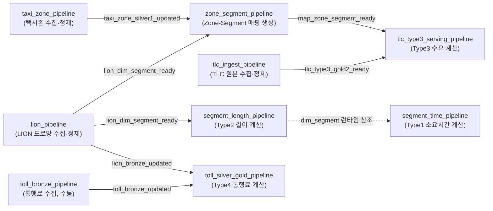

<h1 align="center">🌐 택시 내비게이션용 도로 정보 API</h1>

내비게이션 경로 계산에 필요한 도로 세그먼트별 정보(소요시간·길이·통행료 등)를 데이터 파이프라인으로 구축해 API로 제공합니다. 
택시 전용 기능으로, 세그먼트별 택시 승차 승객 수 정보도 함께 제공합니다.

  
  
  

소프티어 부트캠프 8기 · Data Engineering 5조 · 김지원 · 이동찬 · 이승연

---

## 목차

1. [프로덕트 개요](#1-프로덕트-개요)
2. [최종 데이터 스키마](#2-최종-데이터-스키마)
3. [데이터 파이프라인과 아키텍처](#3-데이터-파이프라인과-아키텍처)
4. [AWS 아키텍처](#4-aws-아키텍처)
5. [Airflow DAG 설계](#5-airflow-dag-설계)
6. [스키마 검증](#6-스키마-검증)
7. [모니터링](#7-모니터링)
8. [기술적 고민과 결정](#8-기술적-고민과-결정)
9. [기술 스택](#9-기술-스택)
10. [한계와 다음 단계](#10-한계와-다음-단계)
11. [팀원 소개](#11-팀원-소개)

## 1. 프로덕트 개요

### **문제 정의**
- **누구의**: 택시 내비게이션 개발 회사의 라우팅 엔지니어링팀

- **어떤 문제**: 라우팅 알고리즘을 갖고 있지만, 도로별 최신 데이터(통행 소요시간, 길이, 통행료 등) 및 승차 승객 수 데이터가 경로 계산에 바로 활용 가능한 형태로 제공되지 않습니다.

- **해결책**: 택시 내비게이션 경로 탐색에 필요한 도로 세그먼트(10-20m 수준의 도로 조각)별 정보를 데이터 파이프라인으로 구축해 API로 제공합니다.

### **주요 기능**

| type | 지표 | 용도 |
| :---: | --- | --- |
| 1 | 도로 세그먼트별 통행 소요시간 | 빠른 경로 | 
| 2 | 도로 세그먼트별 길이 | 짧은 경로 |
| 3 | 도로 세그먼트별 택시 승차 승객 수 (택시 전용) | 승객 많은 경로 | 
| 4 | 도로 세그먼트별 통행료 | 무료 경로 |

---

## 2. 최종 데이터 스키마

4개 지표는 갱신 주기와 grain이 달라 테이블을 4개로 분리했습니다. 조회 시 추가 쿼리 없이 한 번에 필요한 값을 다 가져올 수 있도록, 관련된 값은 같은 행의 컬럼으로 둡니다(PK: **segment_id, time**).

### **segment_metrics_type1: 통행 소요시간**

| 컬럼 | 설명 | 예시 |
| --- | --- | --- |
| segment_id | 세그먼트 식별자 | "0151677" |
| time | 30분 단위 시간 버킷 | "0830" |
| value | 최신 실측 통과시간(초) | 38 |
| last_sample_at | value가 관측된 시각 — 신선도 판정용 | 2026-08-27T08:31:02Z |
| avg | 과거 평균 통과시간(초) | 44 |
| count | avg 증분 갱신 계산용 누적 횟수 | 312 |
| updated_date | 이 행이 마지막으로 갱신된 날짜 | 2026-08-27 |

### **segment_metrics_type2: 길이**

| 컬럼 | 설명 | 예시 |
| --- | --- | --- |
| segment_id | 세그먼트 식별자 | "0151677" |
| value | 길이(m) | 255 |

### **segment_metrics_type3: 승차 승객수**

| 컬럼 | 설명 | 예시 |
| --- | --- | --- |
| segment_id | 세그먼트 식별자 | "0151677" |
| dow | 요일 | "MON" |
| time | 30분 단위 시간 버킷 | "0900" |
| value | 평균 승차 수 | 12 |

### **segment_metrics_type4: 통행료**

| 컬럼 | 설명 | 예시 |
| --- | --- | --- |
| segment_id | 세그먼트 식별자 | "0247694" |
| value | 혼잡통행료 + 도로통행료 합산 금액(달러) | 0.75 |

### **API 요청-응답 예시**

| type | 예시 요청 | 예시 응답 | 소스 |
| :---: | --- | --- | --- |
| 1 (통행 소요시간) | `{"segment_ids": ["1000", "1001", "1002"], "type": 1, "date": "2026-08-27", "time": "09:00"}` | `{"value": [38, 23, 24]}` — 초 | [도로 속도 관측 데이터(5분 주기)](https://data.cityofnewyork.us/Transportation/DOT-Traffic-Speeds-NBE/i4gi-tjb9) |
| 2 (길이) | `{"segment_ids": ["1000", "1001", "1002"], "type": 2, "date": "2026-08-27", "time": "09:00"}` | `{"value": [25, 32, 20]}` — m | [NYC 도로망(LION) 원본](https://data.cityofnewyork.us/City-Government/LION/2v4z-66xt) |
| 3 (택시 승차 승객 수) | `{"segment_ids": ["1000", "1001", "1002"], "type": 3, "date": "2026-08-27", "time": "09:00"}` | `{"value": [12, 20, 12]}` — 승객 수 | [NYC TLC 택시 운행 기록](https://www.nyc.gov/site/tlc/about/tlc-trip-record-data.page) |
| 4 (통행료) | `{"segment_ids": ["1000", "1001", "1002"], "type": 4, "date": "2026-08-27", "time": "09:00"}` | `{"value": [0.75, 0, 0]}` — 달러 | [MTA·Port Authority 통행료 데이터](https://www.mta.info/fares-tolls/tolls/vehicle-types) |

라우팅 엔지니어링팀은 API로 받은 세그먼트별 데이터를 자체 라우팅 알고리즘에 결합해, 최종 고객에게 아래 4가지 종류의 경로를 제공할 수 있습니다.

**1. <mark style="background-color:#fef08a; color:#1a1a1a;">빠른 경로</mark>**

**2. <mark style="background-color:#fef08a; color:#1a1a1a;">최단 거리 경로</mark>**

**3. <mark style="background-color:#fef08a; color:#1a1a1a;">무료 경로</mark>**

**4. <mark style="background-color:#fef08a; color:#1a1a1a;">승객 많은 경로</mark>**

## 3. 데이터 파이프라인과 아키텍처

### **파이프라인 INPUT**

| 제공처 | 수집 대상 | 수집 방식 | 주기 | 규모 |
| --- | --- | --- | --- | --- |
| NYC DOT / NYC Open Data | 도로별 속도 데이터 | Socrata API| 5분 | 실제 관측 지점 125개 |
| NYC DCP / NYC Open Data | 도로망(LION) | Socrata API | 분기 1회 | 세그먼트 218,373개 |
| NYC TLC Data | 택시 운행 기록 | 정적 파일 다운로드 | 월 1회 | 월 수천만 건 |
| NYC TLC Data | 택시존 | 정적 파일 다운로드 | 최초 1회 | 263개 zone |
| MTA·Port Authority / NY Open Data | 도로·혼잡 통행료 | 크롤러 | 정책 변경 시 | — |

### **파이프라인 OUTPUT**

| type | 계산 방식 | 산출값 | 규모 | 업데이트 주기 |
| :---: | --- | --- | --- | --- |
| 세그먼트별 통과시간 (type1) | 길이 ÷ 가중평균 속도 | 30분 버킷 통과시간(초) | 약 1,000만 행 | 30분 |
| 세그먼트별 길이 (type2) | LION 원본 그대로 | 정적 길이값(m) | 약 22만 행 | LION 갱신 시(분기 1회) |
| 세그먼트별 택시 승차수요 (type3) | 최근 N주 평균 → zone→segment 확산 | 요일×30분 슬롯 평균 승차수 | 약 7,000만 건 ~ 1억 건| 한 달 |
| 세그먼트별 통행료 (type4) | 혼잡통행료 + 도로통행료 합산 | 세그먼트당 통행료 | — (통행료 대상만, 희소) | 통행료·LION 원본 갱신 시(요금표는 매달 1일 변경 여부 확인) |

## 4. AWS 아키텍처

| 구성 | 서비스 | 역할 |
| --- | --- | --- |
| Data Lake | S3 | Bronze/Silver/Gold 원본·중간·최종 데이터 저장 |
| 이미지 저장소 | ECR | Airflow·Spark 실행용 컨테이너 이미지 저장 |
| 오케스트레이션 | EC2(Airflow) | 파이프라인 스케줄링 및 실행 관리 |
| 대용량 처리 | EMR(Spark) | Silver/Gold 단계 데이터 정제·집계 |
| 서빙 저장소 | RDS(Gold DB) | 최종 지표(type1~4) 저장, API 조회 대상 |
| 서빙 API | Lambda | RDS 조회 + 인메모리 캐시로 응답 생성 |
| API 엔드포인트 | API Gateway | 외부 요청을 Lambda로 라우팅 |
| 대시보드 | S3(정적 호스팅) | 프론트엔드 대시보드 배포 |

※ EC2·EMR·RDS는 같은 VPC 안에서 통신합니다.

## 5. Airflow DAG 설계

타입마다 원본 데이터의 갱신 패턴이 달라, DAG 스케줄도 타입별로 다르게 설계했습니다. 9개 DAG는 트리거 방식 기준 **Cron 4개 + Asset 4개 + 수동 1개**로 나뉩니다.

> `segment_time_pipeline`은 Asset 의존이 없어 30분마다 독립적으로 실행되지만, 실행 중 `segment_length_pipeline`이 만든 최신 `dim_segment.parquet`을 코드 레벨로 참조합니다(점선으로 표시, Asset 트리거는 아님).

**Cron 스케줄 (4개)**

| DAG | 주기 | 역할 |
| --- | --- | --- |
| lion_pipeline | 매일 04:00 (`0 4 * * *`) | LION 도로망 원본 수집·정제 |
| taxi_zone_pipeline | 매월 1일 04:00 (`0 4 1 * *`) | 택시존 원본 수집·정제 |
| segment_time_pipeline | 30분마다 (`*/30 * * * *`) | Type1(소요시간) 계산 |
| tlc_ingest_pipeline | 매주 월요일 04:00 (`0 4 * * 1`) | TLC 원본 수집·정제 |

**Asset 트리거 (4개)** — `|`는 OR 조건, 연결된 Asset 중 하나만 갱신돼도 실행됩니다.

| DAG | 의존 Asset | 발행 DAG | 설명 |
| --- | --- | --- | --- |
| segment_length_pipeline | `lion_dim_segment_ready` | lion_pipeline | LION 도로망이 갱신되면 Type2(길이)를 다시 계산한다 |
| zone_segment_pipeline | `lion_dim_segment_ready` \| `taxi_zone_silver1_updated` | lion_pipeline, taxi_zone_pipeline | LION 도로망 또는 택시존 정보가 바뀌면 Zone-Segment 매핑을 다시 만든다 |
| toll_silver_gold_pipeline | `toll_bronze_updated` \| `lion_bronze_updated` | toll_bronze_pipeline, lion_pipeline | 통행료 원본 또는 LION 도로망이 바뀌면 Type4(통행료)를 다시 계산한다 |
| tlc_type3_serving_pipeline | `tlc_type3_gold2_ready` \| `map_zone_segment_ready` | tlc_ingest_pipeline, zone_segment_pipeline | TLC 집계 결과 또는 Zone-Segment 매핑이 바뀌면 Type3(수요)를 다시 서빙한다 |

**수동 트리거 (1개)**

| DAG | 역할 |
| --- | --- |
| toll_bronze_pipeline | 통행료 원본 수집. 요금표 변경 여부를 사람이 확인한 뒤 직접 실행 |

### DAG별 태스크 목록

lion_pipeline

| 태스크 | 역할 |
| --- | --- |
| ingest_lion | LION 원본 데이터 수집(Bronze) |
| build_dim_segment_staged | dim_segment 스테이징 테이블 빌드 |
| validate_staged_dim_segment | 스테이징 데이터 검증 |
| publish_dim_segment | 검증 통과한 dim_segment 게시(운영 반영) |
| cleanup_dim_segment_staging | 스테이징 임시 데이터 정리 |

taxi_zone_pipeline

| 태스크 | 역할 |
| --- | --- |
| ingest_taxi_zone_shapefile | 택시존 shapefile 원본 수집 |
| build_taxi_zone_silver1 | 택시존 Silver1 정제(변경 없으면 게시 스킵) |

toll_bronze_pipeline

| 태스크 | 역할 |
| --- | --- |
| upload_rates_task | 통행료 요금표 업로드 |
| upload_facilities_task | 통행료 부과 시설 목록 업로드 |
| upload_cbd_geofence_task | 혼잡통행료 구역(CBD) geofence 업로드 |
| publish_toll_bronze | 통행료 Bronze 게시 |

toll_rate_monitor

| 태스크 | 역할 |
| --- | --- |
| send_reminder | 매달 요금표 변경 여부 확인 Slack 알림 |

segment_time_pipeline

| 태스크 | 역할 |
| --- | --- |
| check_new_data | 신규 속도 데이터 존재 확인(short-circuit) |
| collect_bronze | 도로 속도 데이터 수집(Bronze) |
| check_dim_segment_exists | dim_segment 존재 여부 확인(short-circuit) |
| submit_nav_time_job | Type1 Silver/Gold 계산 작업 제출(EMR) |

tlc_daily

| 태스크 | 역할 |
| --- | --- |
| generate_incremental_download_list | 신규 다운로드 대상 목록 생성 |
| download_file | TLC 파일 다운로드(taxi_type별 병렬) |
| validate_download | 다운로드 결과 검증 |
| store_bronze | Bronze 저장 |
| find_pending_silver_files | Bronze는 있지만 Silver1 미완료인 파일 복구 |
| chunk_bronze_files | taxi_type별 청크 묶기 |
| validate_bronze_quality | 청크별 Bronze 품질 검증(Great Expectations) |
| build_silver | 검증 통과 파일 Silver1 변환·저장 |
| find_pending_type3_months | Type3 처리 대상 월 탐색 |
| build_type3_staged_records | Type3 임시(스테이징) 레코드 생성 |
| validate_type3_staged_records | Type3 스테이징 레코드 검증 |
| publish_type3_daily_records | 검증 통과분 운영 파티션으로 승격 |
| cleanup_type3_staging | Type3 스테이징 정리 |
| check_type3_publish_needed | RDS 값이 최신 N주보다 오래됐는지 판단 |
| check_type3_reference_ready | zone-segment 매핑 준비 여부 확인 |
| publish_type3_rolling_values | Type3 롤링 평균 RDS 게시 |

segment_length_pipeline

| 태스크 | 역할 |
| --- | --- |
| build_gold2_lion | Gold 계산용 LION 데이터 빌드 |
| submit_nav_length_job | Type2 계산 작업 제출(EMR) |
| build_and_write_spec_estimates | 스펙 기반 추정치 계산·기록 |

zone_segment_pipeline

| 태스크 | 역할 |
| --- | --- |
| validate_reference_inputs | 참조 입력(LION·택시존) 유효성 검증 |
| build_map_zone_segment_staged | zone-segment 매핑 스테이징 빌드 |
| validate_staged_map_zone_segment | 매핑 스테이징 검증 |
| publish_map_zone_segment | 검증 통과한 매핑 게시 |

toll_silver_gold_pipeline

| 태스크 | 역할 |
| --- | --- |
| find_latest_lion_gdb | 최신 LION GDB 파일 탐색 |
| build_lion_facility_mapping_task | 시설-세그먼트 매핑 빌드 |
| build_lion_cbd_mapping_task | CBD(혼잡구역)-세그먼트 매핑 빌드 |
| build_and_write_gold | Type4 Gold 계산·RDS 기록 |

## 6. 스키마 검증

| 검증 지점 | 검증 방식·라이브러리 | 코드에 정의한 스키마 | 검증 예시 | 구현 |
| --- | --- | --- | --- | --- |
| **API 요청·응답** | FastAPI + Pydantic의 `BaseModel`, `Field`, `Literal` | `segment_ids` 1-500개, type은 1-4, 날짜는 `YYYY-MM-DD`, 시간은 `HH:MM`, 응답은 숫자 배열로 제한 | `type=5`, 빈 경로, `25:00` 요청은 FastAPI가 422로 거부 | [`src/serving/nav_api.py`](src/serving/nav_api.py) |
| **TLC Bronze 원본** | Great Expectations의 `ExpectColumnToExist`를 PySpark DataFrame에 실행 | 택시 종류마다 서로 다른 필수 원본 컬럼을 검사 | Yellow Taxi 파일에 `tpep_dropoff_datetime`이 없으면 critical 스키마 실패로 판정 | [`src/tlc/expectations.py`](src/tlc/expectations.py), [`src/tlc/bronze_validation.py`](src/tlc/bronze_validation.py) |
| **TLC Silver1 공통 스키마** | PySpark SQL의 `StructType`, `StructField`, `cast` | 네 종류의 TLC 데이터를 `timestamp 2개 + integer 3개 + double 1개`의 공통 6개 컬럼으로 변환 | FHV에 원래 없는 `passenger_count`, `trip_distance`는 지정 타입의 nullable 컬럼으로 추가하고, 필수 원본 컬럼 누락은 거부 | [`src/tlc/silver1_transform.py`](src/tlc/silver1_transform.py) |
| **Zone-Segment 매핑** | pandas DataFrame의 `is_unique`, `isna`, `between`, `isin` | 모든 LION `segment_id`가 정확히 하나의 `zone_id`를 가져야 하며, zone은 1~263, 매핑 방식은 `contains` 또는 `nearest`만 허용 | 입력 세그먼트가 218,373개인데 매핑이 218,372개이거나 `segment_id`가 중복되면 검증 실패 | [`src/silver2/zone_segment.py`](src/silver2/zone_segment.py) |
| **Type3 시공간 스키마** | PySpark SQL DataFrame의 `filter`, `groupBy`, `distinct`, `count` | Zone 결과는 `zone_id, type, date, time, value`, Segment 결과는 `segment_id, type, dow, time, value`로 고정하고 복합키와 전체 시간대 coverage를 검사 | 컬럼은 정상이더라도 특정 Zone의 14:30 값이 빠지면 `Zone × 날짜 × 48개 시간대` 예상 행 수와 달라 게시 중단 | [`src/tlc/gold2.py`](src/tlc/gold2.py) |

## 7. 모니터링

### 1. Grafana

[Grafana 대시보드 열기](http://3.38.96.76:3000/d/nav-gold-overview/nav-gold-overview-rds-2b-emr-serverless?from=now-24h&to=now&timezone=browser&refresh=1m)

| 관측 영역 | 주요 지표 | 확인 목적 |
| --- | --- | --- |
| 인프라 | RDS 및 EC2 CPU·메모리·디스크 점유율 | 병목이 DB 자원인지 애플리케이션인지 구분 |
| 서빙 | Lambda 호출·소요시간, API Gateway Latency | API 장애·지연 인지 |
| 파이프라인·데이터 | Airflow DAG 상태·태스크 소요시간·최근 실패, 타입별 row 수·마지막 갱신 시각 | DAG 성공 여부와 실제 RDS 데이터 신선도를 교차 검증 |
| 사용자 체감 성능 | RDS 쿼리 p50/p95/p99, 타입별 fallback 계층 비율 | 느린 쿼리와 부정확한 대체값 응답 비율을 함께 추적 |

   
  RDS와 Airflow·Grafana가 동작하는 EC2의 CPU, 메모리, 디스크 상태

#### 모니터링으로 해결한 문제: RDS 쓰기 중 읽기 지연

Type3 Gold 데이터를 RDS 서빙 테이블에 대량 upsert하는 동안 같은 테이블을 읽는 API 쿼리의 응답시간이 증가했고, 일부 쿼리는 1초 `statement_timeout`으로 취소됐습니다. Grafana에서 다음 지표를 함께 비교해 원인을 좁혔습니다.

1. Type3 쿼리 p95/p99(p99는 약 1.7초까지 증가)
2. RDS 직접 조회 실패. 하드코딩 fallback 비율 최대 93.5%까지 급등
3. 같은 시각 RDS CPU와 디스크 지연은 정상 범위. `DatabaseConnections`는 57개에서 76개로 증가
4. 대량 upsert 트랜잭션과 API 읽기 쿼리 사이의 경합이 원인이라고 판단함.

   
  Type3 쿼리 응답시간 분포: 평균만으로 숨겨지는 느린 요청을 p95·p99로 확인

   
  타입별 RDS 직접 조회와 snapshot·hardcoded fallback 비율

해결책으로 운영 테이블에 행 단위 upsert를 반복하는 대신, 새 데이터를 별도 staging 테이블에 모두 적재하고 테이블 이름만 RENAME 하도록 변경했습니다.
API는 완성된 테이블만 읽으므로 배치 쓰기와 서빙 읽기가 같은 테이블에서 오래 경합하지 않습니다.

### 2. Airflow 장애 알림 (Slack)

| 구분 | 핵심 동작 |
| --- | --- |
| 태스크 실패 | 재시도 소진 후 DAG·Task·예외 요약과 Airflow 로그 링크를 Slack으로 전송 |
| 파일 검증 실패 | 제외된 TLC 파일과 사유를 청크당 한 메시지로 요약 |

구현: [`src/common/alerts.py`](src/common/alerts.py)

### 3. 로그

| 구분 | 핵심 동작 |
| --- | --- |
| 지표 로그 | RDS 쿼리 시간·fallback 계층 로그를 CloudWatch Logs Insights로 집계해 Grafana에 표시 |
| 장애 로그 | Lambda는 표준 출력으로 기록하고, EMR 실패 시 Spark Driver 로그 끝부분을 Airflow에 첨부 |

구현: [`src/common/logger.py`](src/common/logger.py), [`src/common/emr_serverless.py`](src/common/emr_serverless.py)

## 8. 기술적 고민과 결정

각 결정의 배경(관측된 사실, 고려한 대안, 기각 사유, 검증 방법)은 링크한 문서에서 자세히 볼 수 있습니다.

| # | 고민 | 결정 | 링크 |
| :---: | --- | --- | --- |
| 1 | (예시) 서빙 저장소로 무엇을 쓸까 → | (예시) 비용 이슈로 DynamoDB 대신 RDS(PostgreSQL) 선택 | [상세](docs/decisions/01-example.md) |
| 2 |  |  | [상세](docs/decisions/02-decision.md) |
| 3 |  |  | [상세](docs/decisions/03-decision.md) |
| 4 |  |  | [상세](docs/decisions/04-decision.md) |
| 5 |  |  | [상세](docs/decisions/05-decision.md) |
| 6 |  |  | [상세](docs/decisions/06-decision.md) |
| 7 |  |  | [상세](docs/decisions/07-decision.md) |
| 8 |  |  | [상세](docs/decisions/08-decision.md) |
| 9 |  |  | [상세](docs/decisions/09-decision.md) |
| 10 |  |  | [상세](docs/decisions/10-decision.md) |
| 11 |  |  | [상세](docs/decisions/11-decision.md) |
| 12 |  |  | [상세](docs/decisions/12-decision.md) |
| 13 |  |  | [상세](docs/decisions/13-decision.md) |
| 14 |  |  | [상세](docs/decisions/14-decision.md) |

## 9. 기술 스택

| 영역 | 스택 |
| --- | --- |
| **오케스트레이션** |  |
| **대용량 처리** |   |
| **데이터 품질** |  |
| **저장소** |    |
| **서빙 API** |  |
| **인프라** |   |
| **CI/CD** |  |
| **모니터링** |  |

## 10. 한계와 다음 단계

| # | 한계 | 시도 | 다음 단계 |
| --- | --- | --- | --- |
| 1 | TLC는 2016년까지만 정확한 탑승 좌표를 제공했고, 이후로는 zone 단위로만 제공합니다. 그래서 지금은 zone 안의 모든 세그먼트에 동일한 수요값을 적용하는데, 실제로는 같은 zone 안에서도 세그먼트별 수요 편차가 있을 것으로 예상됩니다. | zone×요일×시간대 평균을 zone 내 모든 세그먼트에 동일하게 적용 | 2016년 정밀좌표 데이터로 실제 승객이 몰리던 스팟을 추출해, 그 패턴이 현재도 유효한지 비교 검증합니다. 유효하다면 해당 세그먼트에 가중치를 높여 zone 평균 대신 세그먼트별 차등값을 적용하는 방식을 검토합니다. |
| 2 | TLC 승차 데이터는 분석 목적으로 집계된 데이터라, 택시기사가 실시간으로 보고 판단할 지표로는 적합하지 않을 수 있습니다 — 실제 수요라기보다 과거 평균 근사치에 가깝습니다. | zone×요일×시간대 롤링 평균을 수요 지표로 그대로 서빙 | 날씨·이벤트 등 실시간성 있는 변수를 추가로 반영해 근사치의 설명력을 높이고, 이 지표가 실제 기사 의사결정에 유의미한지 실측/피드백 기반으로 검증하는 절차를 마련합니다. API 응답에서도 "실측 수요"가 아닌 "과거 평균 기반 추정치"임을 더 명확히 드러내는 것도 검토합니다. |
| 3 | 속도 데이터(DOT Traffic Speed API)가 다수 세그먼트에서 결측이거나 5분 주기로 들어오지 않는 경우가 잦아, 실측과의 괴리가 존재합니다. 외부 API에 의존하는 이상 근본적으로 피하기 어려운 한계입니다. | 도로 스펙(길이 ÷ 제한속도) 기반 추정치를 계산해, 실측 평균이 아직 없는 (segment_id, time) 슬롯의 avg 컬럼에 미리 채워 넣는 백필([`scripts/backfill_type1_spec_avg.py`](scripts/backfill_type1_spec_avg.py))을 진행했습니다. 이때 count·last_sample_at은 비워둬서, 이후 실측값이 들어오면 자동으로 실측 기반 값으로 대체되도록(비파괴적으로) 처리했습니다. | 스펙 기반 추정치는 정적인 도로 제원만 반영해 실제 혼잡 패턴을 담지 못합니다 — 요일·시간대별로 유사한 도로 유형의 실측 통계를 참고해 초기 추정치 정확도를 높이는 방안을 검토합니다. 결측 세그먼트/슬롯 비율 자체를 모니터링 지표로 노출하는 것도 필요합니다. |
| 4 | 경로가 여러 세그먼트로 이어질 때, 뒤쪽 세그먼트의 조회 시각을 앞쪽 세그먼트들의 "추정" 소요시간을 누적해서 계산합니다. 예를 들어 A→B→C→D 경로로 18:00에 출발한다면, A는 18:00 시각으로 조회해 "3분"을 얻고, B는 A 통과 직후인 18:03으로 가정해 조회, C는 그렇게 누적된 시각을 기준으로 다시 조회하는 식입니다. 그런데 A 구간의 실제 소요시간이 5분인데 3분으로 잘못 추정됐다면, B 이후 모든 세그먼트의 조회 시각 자체가 이미 어긋난 채로 진행되고 그 오차가 세그먼트를 거칠수록 계속 쌓입니다 — 경로가 길어질수록 부정확해지는 구조적 원인입니다. | 세그먼트마다 순차로 누적 시각을 계산해 조회하는 현재 방식을 그대로 사용 중이며, 별도의 오차 보정 로직은 없습니다. | 일정 누적 세그먼트 수·누적 시간마다 재보정 체크포인트를 두어 오차가 무한정 쌓이지 않게 하는 방안, 혹은 추정 오차 범위(신뢰구간)를 함께 반환해 경로가 길어질수록 오차가 커질 수 있음을 응답에서 알 수 있게 하는 방안을 검토합니다. |
| 5 | 비용에 대한 고려가 부족했습니다. 처음에 DynamoDB를 도입했지만 예상보다 과금이 크게 나와 RDS로 전환했고, EMR도 급하지 않은 배치 작업인데 최대한 빨리 파이프라인을 돌리려는 방향으로 자원을 여유 있게(과하게) 끌어다 썼습니다. | DynamoDB는 key-value 접근 패턴에 맞고 운영 부담이 없다는 장점 때문에 채택했지만, 타입별로 갱신 주기·쓰기 패턴이 크게 달라 그 장점(오토스케일링, 완전관리형 처리량)을 제대로 활용하지 못한 채 쓰다가 비용 문제로 RDS로 옮겼습니다([8. 기술적 고민과 결정](#8-기술적-고민과-결정) 참고). EMR도 지연이 허용되는 배치 작업들까지 매번 최대 리소스로 최대한 빨리 끝내는 방향으로 잡을 설정했습니다. | ① 워크로드를 "즉시 필요한 작업"과 "지연 허용 가능한 배치 작업"으로 구분해, 후자는 executor 수·리소스를 명시적으로 낮춘 설정으로 돌립니다. ② 저장소·인프라를 채택하기 전에 그 워크로드의 접근 패턴에 실제로 맞는지, 해당 서비스 고유 장점을 활용할 수 있는지부터 검증한 뒤 결정하는 순서로 바꿉니다(이번엔 반대로 갔다는 것을 인정합니다). ③ 파이프라인·서비스별 예상 비용을 사전에 어림 계산해보고 실제 청구액과 비교하는 절차를 도입합니다(지금은 사후에야 알게 됩니다). ④ AWS Budget Alert로 임계치를 넘기면 사전에 알림을 받도록 구성합니다. |

## 11. 팀원 소개

<table>
  <tr>
    <td align="center"></td>
    <td align="center"></td>
    <td align="center"></td>
  </tr>
  <tr>
    <td align="center"><b><a href="https://github.com/dongchan21">이동찬</a></b></td>
    <td align="center"><b><a href="https://github.com/lsy341">이승연</a></b></td>
    <td align="center"><b><a href="https://github.com/tmsklo0428">김지원</a></b></td>
  </tr>
</table>

